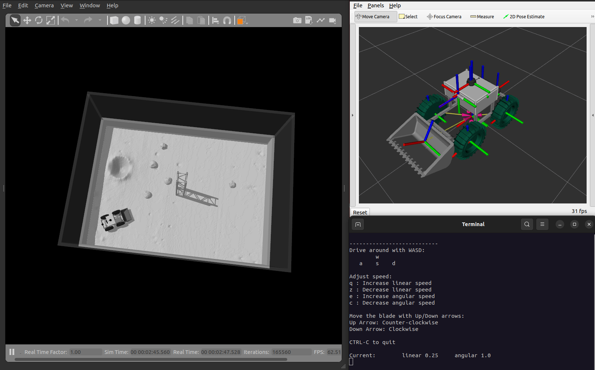

# Project Overview

This repository contains the simulationsoftware developed by the College of DuPage team for the 2024-2025 NASA Lunabotics competition. It is built for ROS 2 Humble on Ubuntu 22.04.

## Software Requirements

- rtabmap
- rtabmap_ros
- rplidar_ros
- apriltag_ros
- navigation2
- robot_localization
- laser_filters
- imu_complementary_filter
- ros2_control
- ros2_controllers
- xacro

## Installation

Note: You will need to have already installed ROS 2 Humble before continuing with installation. The guide can be found [here](https://docs.ros.org/en/humble/Installation/Ubuntu-Install-Debs.html). Install both `ros-humble-desktop` and `ros-dev-tools`.

#### (Optional) 1. Append lines to .bashrc

.bashrc is a script that runs everytime a new terminal window is opened and has various configurations, environment variables, and commands for setup. There is a bug in the VSCode terminal that will cause a symbol lookup error, so you have to unset the path variable using `unset GTK_path`. If you haven't already added `source /opt/ros/humble/setup.bash` to your .bashrc file, it simply runs the setup script for ROS 2 Humble.

```bash
echo 'unset GTK_PATH' >> ~/.bashrc
echo 'source /opt/ros/humble/setup.bash' >> ~/.bashrc
```

This will permanently append these two lines to your .bashrc file, so there is no need to run it again. If you want to edit the file manually, use `nano ~/.bashrc` or `gedit ~/.bashrc` if you prefer a text editor GUI instead.

#### 2. Setup workspace and clone repository

```bash
mkdir -p ~/lunabot_ws/src
cd ~/lunabot_ws/src
git clone https://github.com/grayson-arendt/Lunabotics-2025-Simulation.git
```

#### 3. Install dependencies

Run the installation script to install the required dependencies. `chmod +x` gives permission for the script to be executable. In any step that `chmod +x` is used, it will only need to be ran once.

```bash
cd ~/lunabot_ws/src/Lunabotics-2025-Simulation/scripts
chmod +x install_dependencies.sh
sudo ./install_dependencies.sh
```

#### 4. Build the workspace

```bash
cd ~/lunabot_ws
colcon build
```

## Simulating the Robot

Gazebo simulation can be slow depending on your computer's specifications. You can control the robot with an Xbox One controller by specifying the control mode with `control_mode:=xbox`. In this mode, the left joystick controls the drivetrain, while the right joystick’s y-axis moves the dozer blade.

#### 1. Navigate to workspace and source setup

```bash
cd ~/lunabot_ws
source install/setup.bash
```

#### 2. Launch Gazebo and RViz2

```bash
ros2 launch lunabot_bringup simulation_launch.py control_mode:=keyboard #control_mode:=xbox
```

<p align="center">
  
</p>
